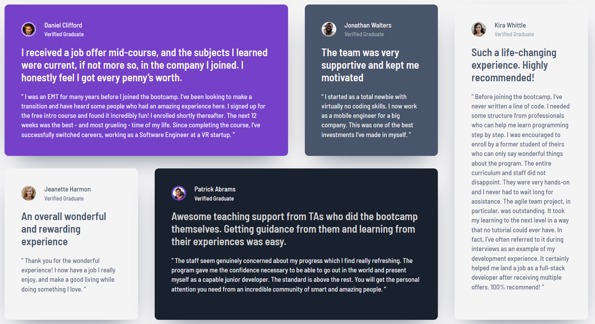

# Frontend Mentor - Testimonials Grid Section

A solution to the [Testimonials Grid Section](https://www.frontendmentor.io/challenges/testimonials-grid-section-Nnw6J7Un7) challenge on Frontend Mentor. Built with plain HTML and CSS — no frameworks.

**Live Site:** https://hshs-dev.github.io/testimonials-grid-section-main/

## Screenshot

    

## Built with

* Mobile-first workflow
* Semantic HTML5
* CSS custom properties
* CSS Grid for tablet and desktop layouts
* Flexbox for the mobile layout
* CSS media queries for responsiveness
* Barlow Semi Condensed from Google Fonts

## Reflections

### What I learned

* `grid-template-areas` makes complex grid layouts much easier to understand and maintain.
* A layout does not need to use the same CSS layout system at every breakpoint — Flexbox worked well for stacking the cards on mobile, while Grid was a better fit for the structured tablet and desktop layouts.
* CSS Grid becomes especially useful when elements need to occupy different numbers of columns and rows at larger screen sizes.
* CSS custom properties make managing colors, typography, and other repeated design values much cleaner.
* Semantic elements such as `<article>`, `<header>`, and `<blockquote>` can describe the structure of a component without relying entirely on generic `
` elements.
* Using a mobile-first approach made the initial layout simpler before introducing the more complex grid arrangements for larger screens.

### Challenges

The main challenge was creating the responsive grid while keeping the layout close to the reference design at different screen sizes.

The desktop layout uses four columns and two rows with named grid areas, while the tablet layout uses a different arrangement. Managing these changes with separate `grid-template-areas` definitions was much cleaner than trying to completely reset and rebuild the grid at each breakpoint.

Another useful challenge was getting comfortable with deciding when to use Grid versus Flexbox instead of forcing one layout method to handle everything.

## Useful resources

* [Josh Comeau's CSS Reset](https://www.joshwcomeau.com/css/custom-css-reset/) - Used as the foundation for the CSS reset in this project.
* [Frontend Mentor](https://www.frontendmentor.io/) - Provided the challenge, design reference, and assets.

## AI Collaboration

I used AI as a study partner while working on this project. It was mainly useful for reviewing CSS and HTML decisions, discussing different layout approaches, and helping me refine my understanding of responsive Grid and Flexbox rather than replacing the implementation work.

## Author

* GitHub - [@HsHs-dev](https://github.com/HsHs-dev)
* Frontend Mentor - [@HsHs-dev](https://www.frontendmentor.io/profile/HsHs-dev)
